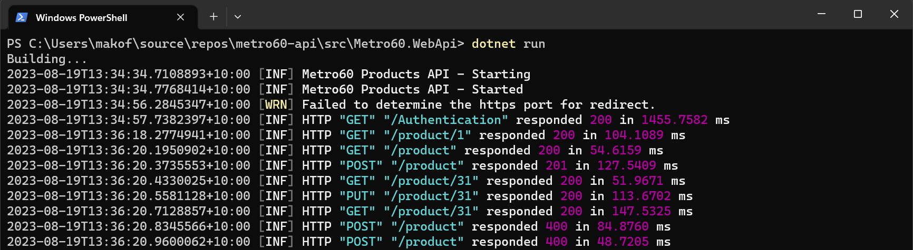
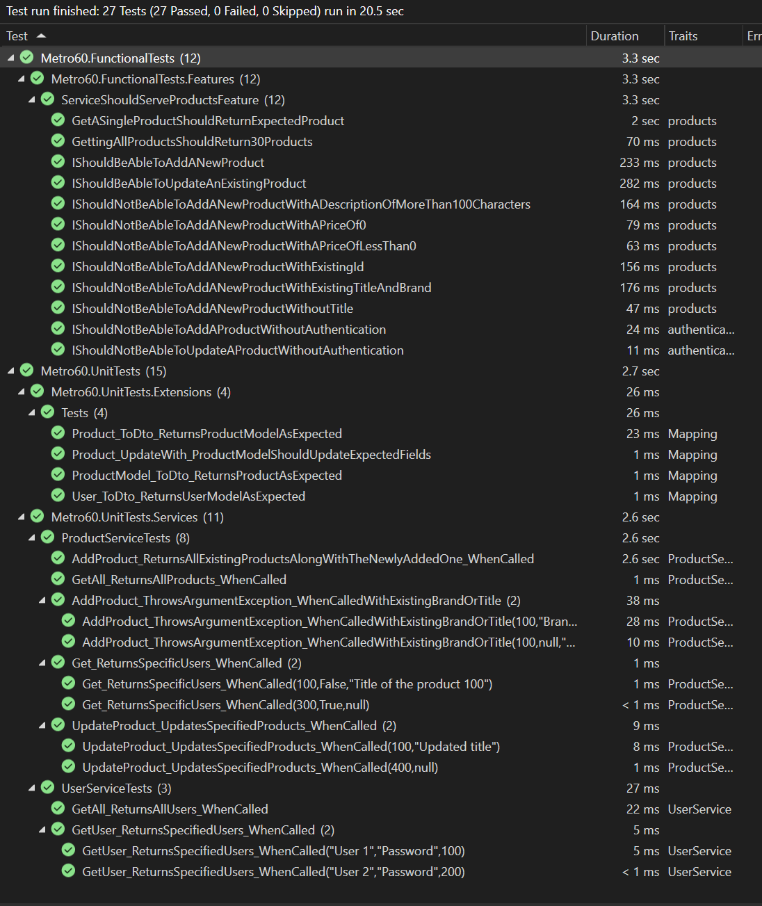
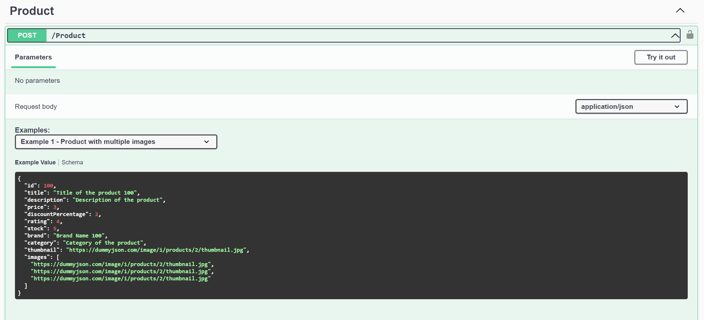
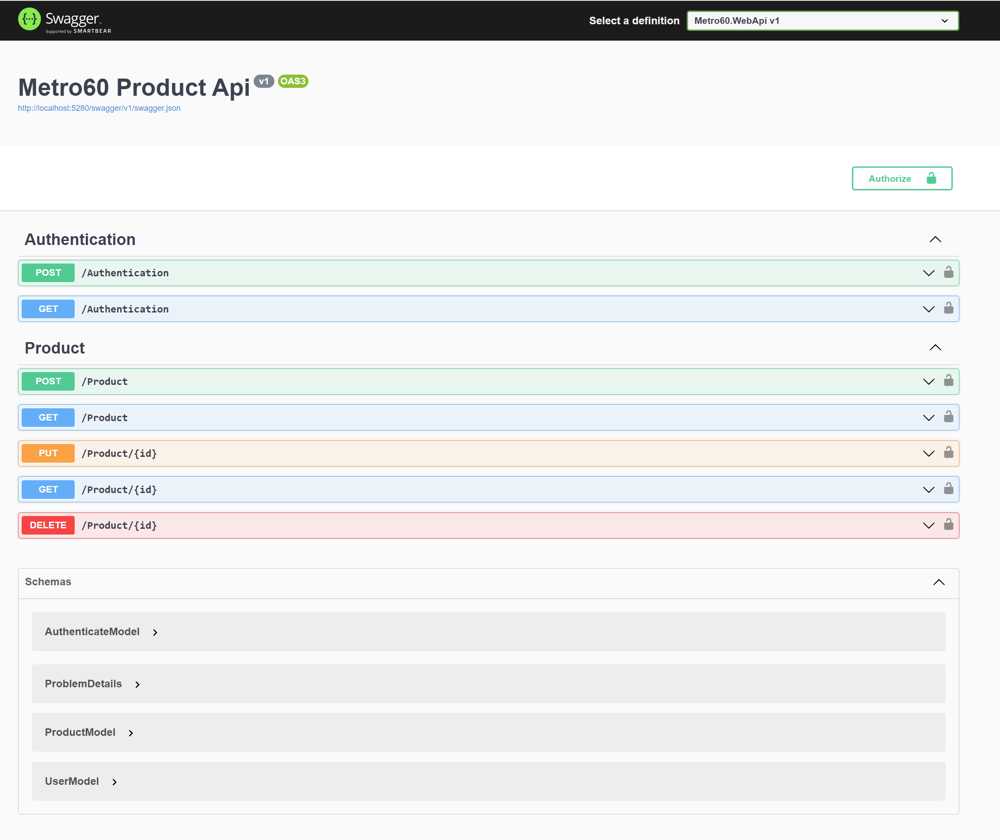

# Metro60 Product API
Web API with basic authentication serving file based data.

## Table of contents
- [How to run functional tests](#how-to-run-functional-tests)
- [Notes for the reviewers](#notes-for-reviewers)
- [How to run swagger](#how-to-run-swagger)

### How to run functional tests
1. Open Terminal 
2. Navigate to the path `~\metro60-api\src\Metro60.WebApi`
3. Run command: `dotnet run`
4. Open Visual Studio (or any other test runner) and run the functional tests.

Here is the sample output in the console showing the logging of each request:

### Notes for reviewers
- **Specifications** - Each specification mentioned in the email has an associated functional test. Some also have a unit test as well. Duplication of these tests is a good thing since they are testing separate layers of code. Functional tests are more exhaustive. Unit tests spin up an in memory database for demonstration sakes. I have implemented in-memory databases in other projects as well so that the test data doesnt polute the actual data. Other approaches can be the use of a TestContainer. 
- **Limitations** - There were a number of limitations faced with the file based data source. We cannot use the index incrementor, constraint checks, constraints, etc as there is no DBMS. Therefore, some of the requirements were manually coded up or implemented using c# attributes on the model's properties. 
- **Health Checks** - I have added a health check mechanism which can be used by Kubernetes to spin up and check the pods health. This was only done for demonstration sakes. You can check the health by going to `~/api/health`
- **HTTP/HTTPS** - The functional tests are configured for HTTP protocol. This can be changed from the appsettings.json in the functional tests project.
- **Swagger Examples** - I have also demonstrated the use of swagger examples in the `[POST] /product` endpoint:

### How to run swagger
1. Open the solution in Visual Studio 2022. 
2. Build and launch the project.
3. Application is serviced at:
    - https://localhost:7204
    - http://localhost:5280
4. Authentication is provided on the UI. Use the following credentials:
    |  Username  |  Password     |
    |------------|---------------|
    | test_user  | test_password |
    | test       | test          |

